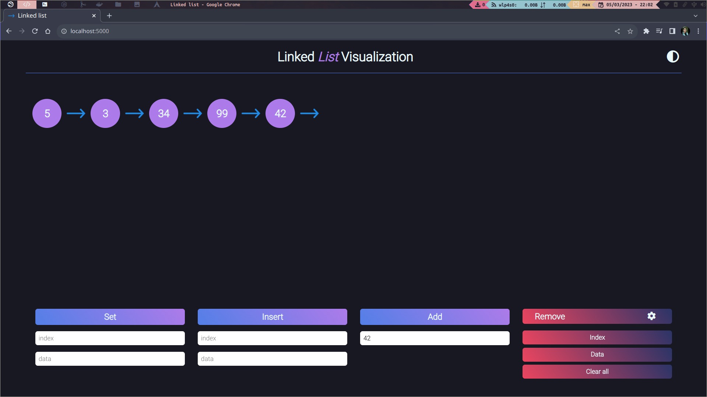

# Linked List Visualization
Linked list animation with JavaScript. Inspired on [Linked List Visualization](https://github.com/antoniosarosi/Linked-List-Visualization).

## Setup

1. Clone this repo.
   ```bash
   git clone https://github.com/aluissp/linked-list-visualization.git
   ```
2. Move into the project.
   ```bash
   cd linked-list-visualization
   ```
3. Install serve with npm.
   ```bash
   sudo npm install --global serve
   ```
4. Finally, run the project with the following command and open the browser in http://localhost:5000/.
   ```bash
   sudo serve -l 5000
   ```
_If you have live server extension in VScode, you don't need to install serve with npm. Just open project with live server._

## Linked list functions


* Add values:  You can provide a number that will be added in the list.
* Insert value: Insert a number at the given index.
* Set value: Update a node value at the given index.
* Remove
  * Index: Give an index to remove.
  * Data: Match the values in the link with the given number to remove it.
  * Clear all: Remove all nodes from linked list.
